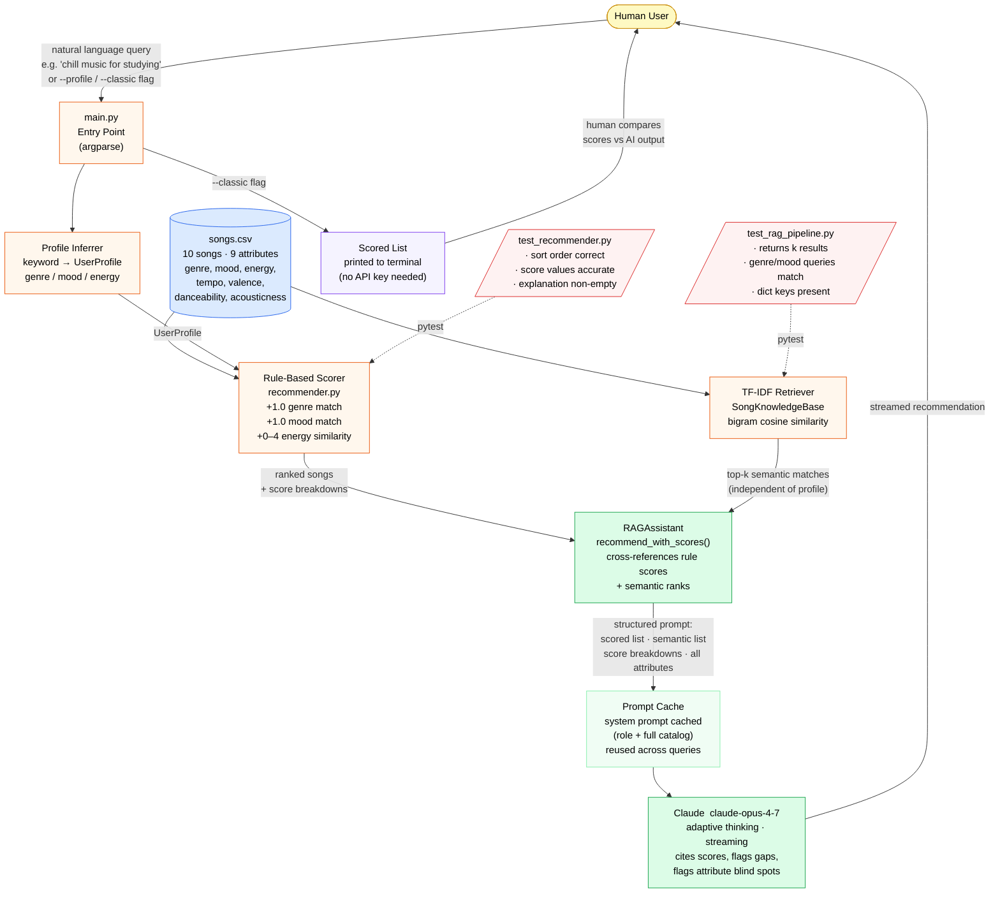

# VibeMatch System Diagram



## Component Reference

| Component | File | Role |
|---|---|---|
| **Entry Point** | `src/main.py` | Parses args, orchestrates both steps, handles fallback |
| **Profile Inferrer** | `src/main.py` | Maps query keywords to a discrete UserProfile |
| **Rule-Based Scorer** | `src/recommender.py` | Scores every song: genre (+1), mood (+1), energy (0–4) |
| **TF-IDF Retriever** | `src/rag_pipeline.py` · `SongKnowledgeBase` | Bigram cosine similarity over song metadata |
| **RAG Assistant** | `src/rag_pipeline.py` · `RAGAssistant` | Combines both signals into a structured Claude prompt |
| **Prompt Cache** | Anthropic API | Caches stable system prompt (role + catalog) across queries |
| **Claude** | `claude-opus-4-7` | Reasons over scores + retrieval, streams recommendation |
| **Knowledge Base** | `data/songs.csv` | 10 songs × 9 attributes; source for both scorer and retriever |

## Data Flow Summary

```
Query
  → Profile Inferrer          (keyword heuristic → genre/mood/energy)
      → Rule-Based Scorer     (scores all 10 songs)
  → TF-IDF Retriever          (cosine similarity → top-3 semantic matches)
      → RAGAssistant           (merges both; builds structured prompt)
          → Claude API         (reasons over evidence; streams output)
              → Human          (reads streamed recommendation)
```

## Testing & Human Verification

- **`test_recommender.py`** — automated: checks scorer sort order and score correctness
- **`test_rag_pipeline.py`** — automated: checks retriever returns right genres/counts/keys
- **`--classic` flag** — human verification: lets a person compare bare scores against AI output side-by-side to spot hallucinations or score/recommendation mismatches
